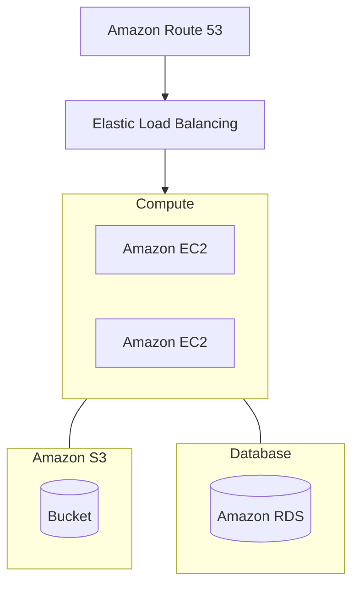
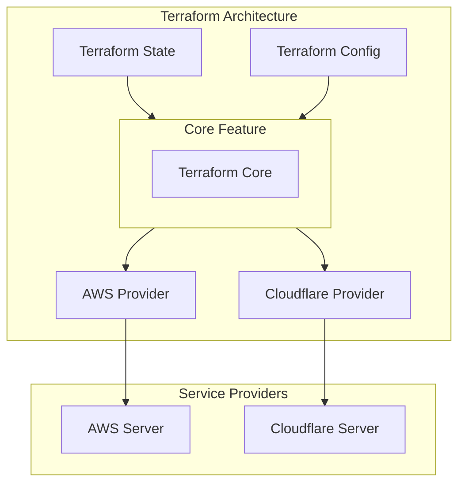

# Learning IaC with Terraform - Chapter I

> Thanks to  
[Course on Youtube](https://www.youtube.com/watch?v=7xngnjfIlK4)

<br />

## Timestamps in Description

1. Evolution of Cloud + Infrastructure as Code (IaC)
2. Terraform Overview + Setup
3. Basic Terraform Usage
4. Variables and Outputs
5. Language Features
6. Project Organization + Modules
7. Managing Multiple Environments
8. Testing Terraform Code
9. Developer Workflows

---

<br />

## What is Terraform?

> Terraform is a tool for building, changing, and versioning infrastructure safely and efficiently.
> 
> \- According to HashiCorp

<br />

## Reference Architecture

- Basic web application
- Infrastructure all within AWS
- Multiple instance running on EC2
- Using default VPC for simplicity

<br />



<br />

---

<br />

## Pre-Cloud 1990s -> 2000s

- Operational Overhead가 매우 Challanging했다.
- Capital Expenses를 운영자가 각각 부담해야 했다.
- On Promise -> Cloud (On Demand)

<br />

### Infrastructure provisioned via APIs

- Infrastructure provisioned via APIs.
- Servers created & destroyed in seconds.
- Long-lived + mutable -> Short-lived + immutable

<br />

### Provisioning Cloud Resources

#### Three Approaches

- GUI (AWS Consoles, ...)
- API/CLI (AWS CLI, ...)
- IaC (Terraform, Serverless, ...)

코드 베이스로 인프라 프로비저닝이 가능함에 따라 일관된 설정과 구성을 명시적으로 나타내고 관리할 수 있다.

<br />

## What is Infrastructure as Code (IaC)?

### Categories of IaC tools: <sup>[1](#footnote_1)</sup>
1. Ad hoc scripts
2. Configuration management tools
3. Server Templating tools
4. Orchestration tools (e.g. Kubernetes)
5. Provisioning tools

- Declarative(선언형) vs. Imperative(명령형)

<br />

## IaC Provisioning Tools Landscape

### Cloud Specific

- Cloud Formation
- Azure Resource Manager
- Google Cloud Deployment Manager

### Cloud Agnostic

- Terraform
- Pulumi
- Serverless

<br />
<br />
<br />

# Part2: Terraform Overview + Setup

## What is Terraform

- Terraform is a tool for building,  changing, and versioning infrastructure safely and efficiently
- Enables application software best practices to infrastructure
- Compatible with many clouds and services

<br />

## Common Patterns

- Provisioning + Config Management
- Provisioning + Server Templating
- Provisioning + Orchestration

<br />

## Terraform Architecture



<br /><br />

---

## Demo Portion

### TODO:
- Install Terraform
- Authenticate to AWS
- Hello world tf config
- Init, Plain, Apply, Destroy

<br />

### Installation
```bash
# Terraform
brew install terraform
terraform -v
# Terraform v1.3.6 on darwin_amd64

# AWS CLI
brew install awscli

aws --v
# aws-cli/2.9.8 Python/3.11.0 Darwin/20.6.0 source/x86_64 prompt/off
```

<br />


### Create IAM Roles

Create User Group with following authorities.
- `AmazonRDSFullAccess`
- `AmazonEC2FullAccess`
- `IAMFullAccess`
- `AmazonS3FullAccess`
- `AmazonDynamoDBFullAccess`
- `AmazonRoute53FullAccess`

<br />


### ⚠️ CAUTION: AWS CLI Credential Settings

```bash
aws configure

# dialog interfaces
AWS Access Key ID [None]: ****************
AWS Secret Access Key [None]: ********************************
Default region name [None]: ap-northeast-2
Default output format [None]: json
```


젠킨스 서버에 AWS CLI 설치 후 인증 설정하기
```bash
$ curl "https://awscli.amazonaws.com/awscli-exe-linux-aarch64.zip" -o "awscliv2.zip"
unzip awscliv2.zip
sudo ./aws/install # 권한이 필요하다면 root 권한으로 실행 (sudo su)
```

<br />
<br />


## 기본 세팅

```bash
# 어떤 프로바이더를 사용할 것인지 명시해주는 가장 기본적인 정의
# AWS Provider를 사용한다.
terraform {
  required_providers {
    aws = {
      source  = "hashicorp/aws"
      version = "~> 4.0"
    }
  }
}

# Default Region을 정의
provider "aws" {
  region = "ap-northeast-2"
}

# EC2 인스턴스를 정의한다.
# AMI는 Amazon Machine Image를 뜻하며 EC2 가상 머신 인스턴스를 생성하기 위한 정보가 담긴 이미지 컨테이너라고 볼 수 있다.
resource "aws_instance" "example" {
  ami           = "ami-035233c9da2fabf52"
  instance_type = "t2.micro"
}
```

> Reference  
*[Resources: aws_instance](https://registry.terraform.io/providers/hashicorp/aws/latest/docs/resources/instance)*

<br />

---

<br />

> Reference  
[Terraform 기본 from terraform101 :: inflearn](https://terraform101.inflearn.devopsart.dev/preparation/terraform-basic/)
## 기본 개념

- `resource`: 실제로 생성할 인프라 자원을 의미
  - e.g. aws_security_group, aws_lb, aws_instance
- `provider`: Terraform으로 정의할 Infrastructure Provider를 의미
  - [Providers - Terraform](https://www.terraform.io/docs/providers/index.html)
- `output` : 인프라를 프로비저닝 한 후에 생성된 자원. Output으로 추출한 부분은 이후에 remote state에서 활용할 수 있음.
- `backend`: Terraform의 상태를 저장할 공간을 지정하는 부분.(Volume 같은) 배포된 최신 상태를 외부에 저장하기 때문에 다른 사람과의 협업이 가능.
- `module`: 공통적으로 활용할 수 있는 인프라 코드를 한 곳으로 모아서 정의함. Module을 사용하면 변수만 바꿔서 동일한 리소스를 생성할 수 있음.
- `remote state`: VPC, IAM과 같은 공용 서비스를 다른 서비스에서 참조할 수 있음. tfstate파일(최신 테라폼 상태 정보)이 저장되어 있는 backend 정보를 명시하면, terraform이 해당 backend에서 output 정보들을 가져옴.

<br />

## 작동 원리

### 3가지 형상
1. Local 코드: 현재 개발자가 작성/수정하고 있는 코드
2. AWS 실제 인프라: 실제 AWS에 배포되어 있는 인프라
3. Backend에 저장된 상태: 가장 최근에 배포한 테라폼 코드 형상

- 여기서 가장 중요한 것은 AWS 실제 인프라와 Backend에 저장된 상태가 100% 일치하도록 만드는 것
- 테라폼에서는 이를 위해 import, state 등 여러 명령어를 제공

<br />

### `terraform init`
- 지정한 backend에 상태 저장을 위한 `.tfstate` 파일을 생성.
- init 작업 이후 local에 .tfstate에 정의된 내용을 담은 `.terraform` 파일 생성
- 다른 개발자가 정의한 `.tfstate`도 init과 함께 local에서 sync 맞출 수 있음

```
$ tree -a .
.
└── main.tf

0 directories, 1 files

$ terraform init
```
AWS Provider로부터 tf 파일에 정의한 모든 코드를 레지스트리로부터 Working Directory로 내려받는다.

```
$ tree -a .
.
└── main.tf
└── .terraform.lock.hcl
└── .terraform
    └── providers
        └── registry.terraform.io
            └── hashicorp
                └── aws
                    └── 3.23.0
                        └── darwin_amd64
                            └── terraform-provider-aws_v3.23.0_x5

7 directories, 3 files
```
architecture의 버전과 코드를 sub directory에서 볼 수 있다. lock파일은 provider가 설치한 특정 의존성 패키지 목록을 나타낸다.

```
$ tree -a .
.
├── main.tf
├── .terraform.lock.hcl
└── .terraform
    └── modules
    │   ├── modules.json
    │   └── vpc
    .   .
    .   .
    │       ├── main.tf
    │       ├── outputs.tf
    │       ├── variables.tf
    │       ├── versions.tf
    │       ├── vpc-endpoints.tf
    │       └── vpc-flow-logs.tf
    └── providers
        └── registry.terraform.io
            └── hashicorp
                └── aws
                    └── 3.23.0
                        └── darwin_amd64
                            └── terraform-provider-aws_v3.23.0_x5

39 directories, 102 files
```

### State File

- Terraform's representation of the world
- JSON file containing information about every resource and data object.
- Contain Sensitive Info (e.g. Database credentials)
- Can be stored locally or remotely

<br />

## Where should Backend be

### Local Backend

- Simple to get started
- Sensitive values in plain text
- Uncollaborative
- Manual

### Remote Backend

- e.g. Terraform Cloud, Amazon S3
- Sensitive data encrypted
- Collaboration possible
- Automation possible
- Increased complexity

<br />

### Backend Examples

```bash
# Remote Backend (Terraform Cloud)
terraform {
  backend "remote" {
    organization = "devops-diretive"

    workspaces {
      name = "terraform-course"
    }
  }
}
```

```bash
# Remote Backend (AWS S3 or DynamoDB)
terraform {
  backend "s3" {
    bucket         = "devops-directive-tf-state"
    key            = "tf-infra/terraform.trstate"
    region         = "ap-northeast-2"
    dynamodb_table = "terraform-state-locking"
    encrypt        = true
  }
}
```

<br />

---

<br />

### `terraform plan`
- 정의한 코드가 어떤 인프라를 만들게 되는지 예측 결과를 미리 보여줌. 단 plan상 문제가 없어도 실제 인프라 배포시 문제가 발생할 수 있음.
- Plan 명령어는 어떠한 형상에도 변화를 주지 않음.

- Terraform Config에서 정의된 Desired State와 실제 AWS에 존재하는 인프라의 Actual State의 Diff를 비교하여 어떻게 Sync를 맞출지 알려주는 것 (AWS Provider <-> AWS)


<br />

### `terraform apply`
- 실제로 인프라를 배포하기 위한 명령어. `apply`를 완료하면, AWS상에 실제로 해당 인프라가 생성되고 작업 결과가 backend의 `.tfstate`파일에 저장됨
- 해당 결과는 local의 `.terraform` 파일에도 저장.

<br />

### `terraform import`
- AWS 인프라에 배포된 리소스를 `terraform state`로 옮겨주는 작업
- 이는 local의 .terraform에 해당 리소스의 상태 정보를 저장해주는 역할을 함. (코드 생성하는거 아님)
  - Apply 전까지 backend에 저장되지 않음.
  - import 이후에 plan을 하면 로컬에 해당 코드가 없기 때문에 리소스가 삭제 또는 변경된다는 결과를 보여줌. 이 결과를 바탕으로 코드를 작성함.
- 만약 기존 인프라를 AWS에 배포한 상태에서 테라폼을 적용하고 싶으면 `terraform import`로 옮겨야 한다.

<br />

### `terraform destroy`
- 테라폼을 사용해서 구축한 인프라를 다시 지워버림
- 매우 주의해야함


<br />
<br />
<br />
<br />
<br />
<br />
<br />
<br />
<br />
<br />

---

<a name="footnote_1">1</a>: From Terraform: Up & Running Writing Infrastructure as Code, Second Edition (O'Reilly Media, 2019) by Yevgeniy Brickman
