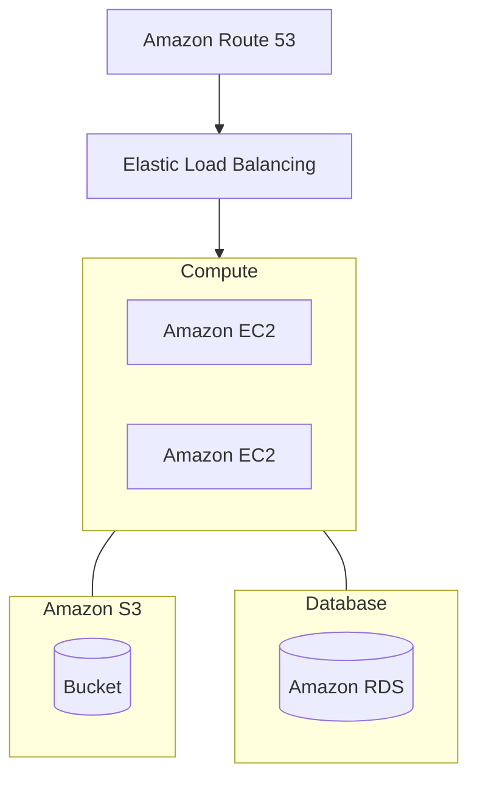
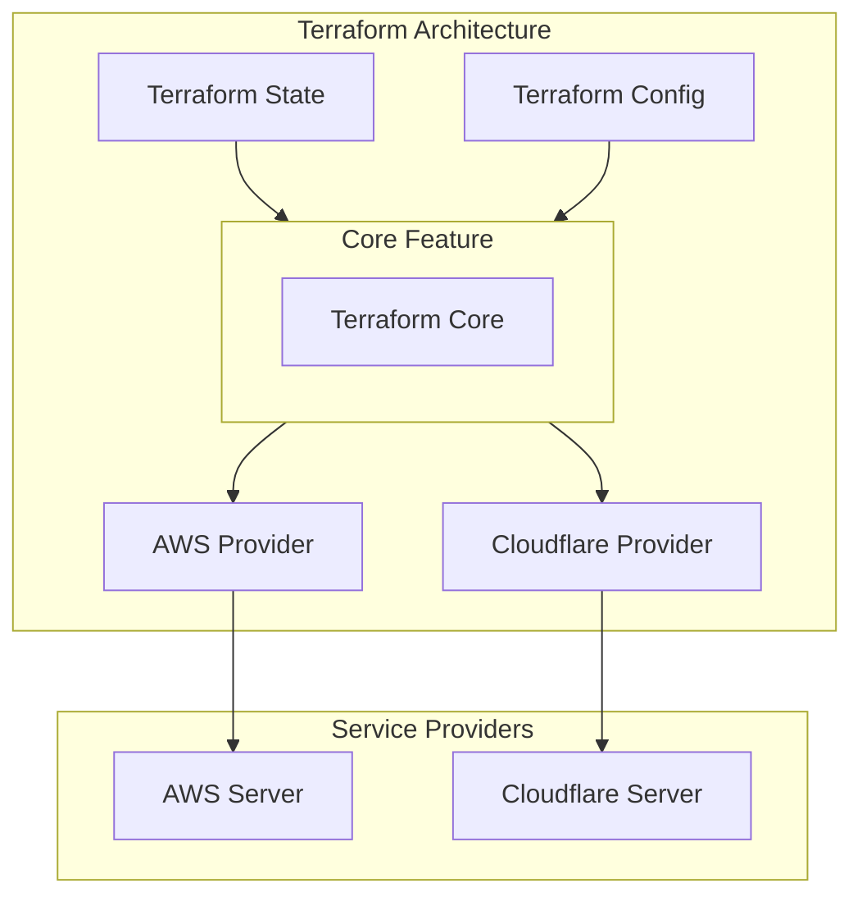

# Complete Terraform Course

[Course on Youtube](https://www.youtube.com/watch?v=7xngnjfIlK4)

<br />

## Timestamps in Description

1. Evolution of Cloud + Infrastructure as Code (IaC)
2. Terraform Overview + Setup
3. Basic Terraform Usage
4. Variables and Outputs
5. Language Features
6. Project Organization + Modules
7. Managing Multiple Environments
8. Testing Terraform Code
9. Developer Workflows

---

<br />

## What is Terraform?

> Terraform is a tool for building, changing, and versioning infrastructure safely and efficiently.
> 
> \- According to HashiCorp

<br />

## Reference Architecture

- Basic web application
- Infrastructure all within AWS
- Multiple instance running on EC2
- Using default VPC for simplicity

<br />



<br />

---

<br />

## Pre-Cloud 1990s -> 2000s

- Operational Overhead가 매우 Challanging했다.
- Capital Expenses를 운영자가 각각 부담해야 했다.
- On Promise -> Cloud (On Demand)

<br />

### Infrastructure provisioned via APIs

- Infrastructure provisioned via APIs.
- Servers created & destroyed in seconds.
- Long-lived + mutable -> Short-lived + immutable

<br />

### Provisioning Cloud Resources

#### Three Approaches

- GUI (AWS Consoles, ...)
- API/CLI (AWS CLI, ...)
- IaC (Terraform, Serverless, ...)

코드 베이스로 인프라 프로비저닝이 가능함에 따라 일관된 설정과 구성을 명시적으로 나타내고 관리할 수 있다.

<br />

## What is Infrastructure as Code (IaC)?

### Categories of IaC tools: <sup>[1](#footnote_1)</sup>
1. Ad hoc scripts
2. Configuration management tools
3. Server Templating tools
4. Orchestration tools (e.g. Kubernetes)
5. Provisioning tools

- Declarative(선언형) vs. Imperative(명령형)

<br />

## IaC Provisioning Tools Landscape

### Cloud Specific

- Cloud Formation
- Azure Resource Manager
- Google Cloud Deployment Manager

### Cloud Agnostic

- Terraform
- Pulumi
- Serverless

<br />
<br />
<br />

# Part2: Terraform Overview + Setup

## What is Terraform

- Terraform is a tool for building,  changing, and versioning infrastructure safely and efficiently
- Enables application software best practices to infrastructure
- Compatible with many clouds and services

<br />

## Common Patterns

- Provisioning + Config Management
- Provisioning + Server Templating
- Provisioning + Orchestration

<br />

## Terraform Architecture



<br /><br />

---

## Demo Portion

### TODO:
- Install Terraform
- Authenticate to AWS
- Hello world tf config
- Init, Plain, Apply, Destroy

<br />

### Installation
```bash
# Terraform
brew install terraform
terraform -v
# Terraform v1.3.6 on darwin_amd64

# AWS CLI
brew install awscli

aws --v
# aws-cli/2.9.8 Python/3.11.0 Darwin/20.6.0 source/x86_64 prompt/off
```

<br />


### Create IAM Roles

Create User Group with following authorities.
- AmazonRDSFullAccess
- AmazonEC2FullAccess
- IAMFullAccess
- AmazonS3FullAccess
- AmazonDynamoDBFullAccess
- AmazonRoute53FullAccess

<br />


### ⚠️ CAUTION: AWS CLI Credential Settings

```bash
aws configure

# dialog interfaces
AWS Access Key ID [None]: ****************
AWS Secret Access Key [None]: ********************************
Default region name [None]: ap-northeast-2
Default output format [None]: json
```


젠킨스 서버에 AWS CLI 설치 후 인증 설정하기
```bash
$ curl "https://awscli.amazonaws.com/awscli-exe-linux-aarch64.zip" -o "awscliv2.zip"
unzip awscliv2.zip
sudo ./aws/install # 권한이 필요하다면 root 권한으로 실행 (sudo su)
```

<br />
<br />


## 기본 세팅

```bash
# 어떤 프로바이더를 사용할 것인지 명시해주는 가장 기본적인 정의
# AWS Provider를 사용한다.
terraform {
  required_providers {
    aws = {
      source  = "hashcorp/aws"
      version = "~> 3.0"
    }
  }
}

# Default Region을 정의
provider "aws" {
  region = "ap-northeast-2"
}

# EC2 인스턴스를 정의한다.
# AMI는 Amazon Machine Image를 뜻하며 EC2 가상 머신 인스턴스를 생성하기 위한 정보가 담긴 이미지 컨테이너라고 볼 수 있다.
resource "aws_instance" "example" {
  ami           = "ami-011899242bb902164" # Ubuntu 20.04 LTS
  instance_type = "t2.micro" # free-tier
}
```
*[Resources: aws_instance](https://registry.terraform.io/providers/hashicorp/aws/latest/docs/resources/instance)*

<br />


<br /><br /><br /><br /><br /><br /><br /><br /><br /><br />

---

<a name="footnote_1">1</a>: From Terraform: Up & Running Writing Infrastructure as Code, Second Edition (O'Reilly Media, 2019) by Yevgeniy Brickman
