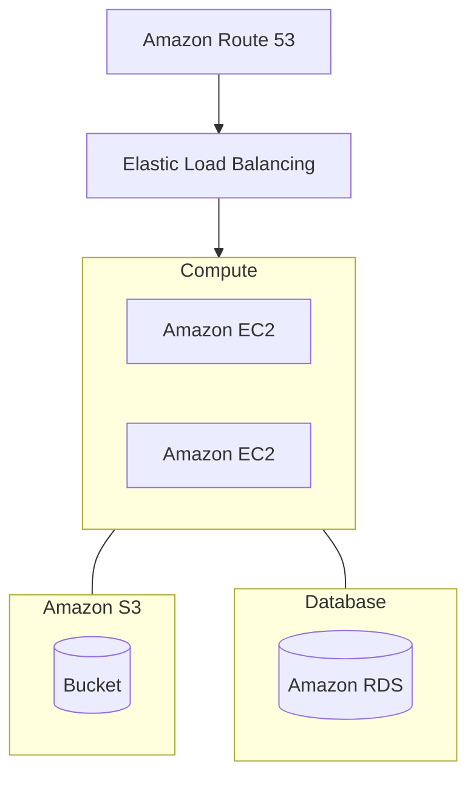

# Learning IaC with Terraform - Chapter II

> Thanks to  
[Course on Youtube](https://www.youtube.com/watch?v=7xngnjfIlK4)

<br />

## Basics

### Todo: Walk through web app TF config
- backend + provider config
- EC2 instances
- S3 Bucket
- VPC
  - Subnet
- Security groups + rules
- Application load balancer
  - ALB target group + attachment
- Route 53 zone + record
- RDS instance

<br />



<br />

---

<br />

```terraform
terraform {
  required_provider {
    aws = {
      source  = "hashicorp/aws"
      version = "~> 4.0"
    }
  }
}

provider "aws" {
  region = "ap-northeast-2"
}

resource "aws_s3_bucket" "terraform_state" {
  bucket        = "devops-directive-tf-state" # REPLACE WITH MY BUCKET NAME
  force_destroy = true
  versioning {
    enabled = true
  }

  server_side_encryption_configuration {
    rule {
      apply_server_side_encryption_by_default {
        sse_algorithm = "AES256"
      }
    }
  }
}
```