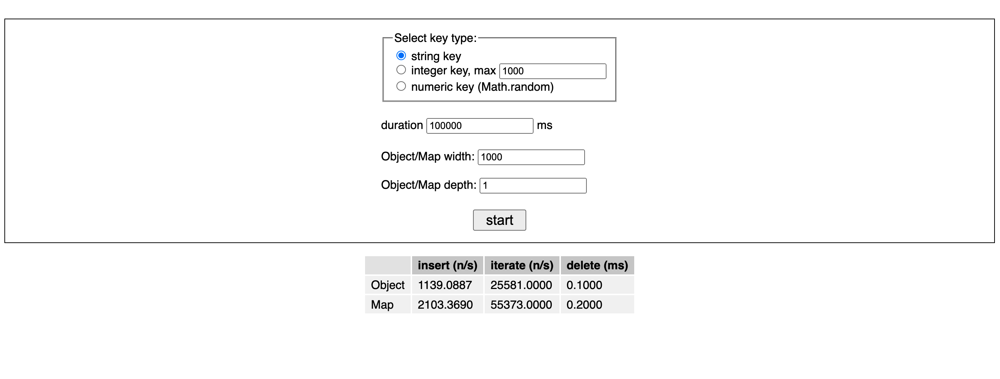
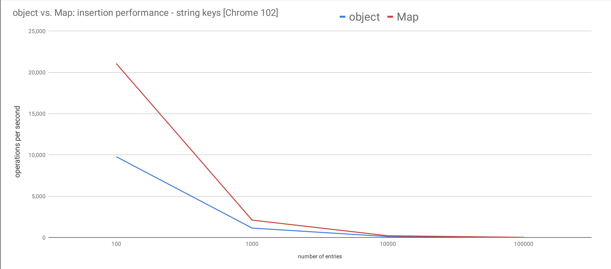
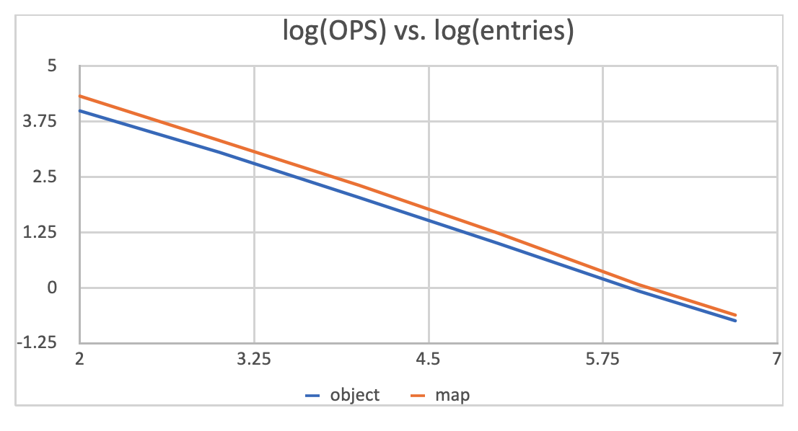
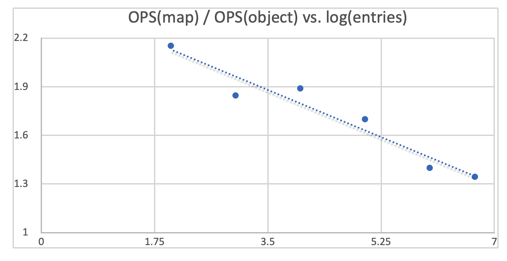
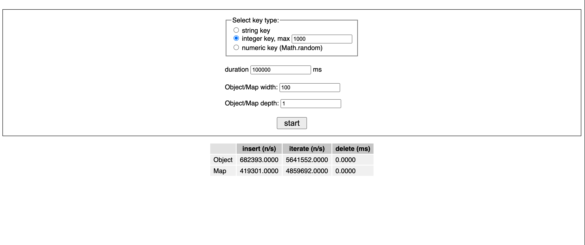

# [translated] When You Should Prefer Map Over Object In JavaScript

*Dec 11 2022*

*Author: [Wonkook Lee](https://github.com/wonkooklee/today-i-learned)*

<br />


<br />


# 원제: When You Should Prefer Map Over Object In JavaScript

> ⚠ disclaimer
> 
> This post is a translated version of [the article of zhenghao.io](https://www.zhenghao.io/posts/object-vs-map#map-for-hash-map) in Korean arbitrarily for the only purpose of case study and sharing JavaScript knowledge.
>
> All the copyrights belong to the author of [zhenghao.io](https://www.zhenghao.io) including images. Thanks.
>
> \- Wonkook Lee

`Map`과 `Set`, `WeakMap`과 `WeakSet`, 그리고 `Symbol`은 ES6 이후 자바스크립트의 고유한 내장 자료형(data-types)임에도 잘 사용하지 않게 됩니다.

특정 API의 인스턴스를 관리하기 위해 `Map`을 사용하던 도중 `Map`과 `Object` 둘 중 어떤 자료형을 해시맵으로 사용하면 좋을지 명확한 기준이 궁금했습니다.

마침 벤치마크 테스트와 함께 각 자료형에 대한 사용 가이드를 제시한 좋은 글이 있어 번역 후 소개드리게 되었습니다.

임의적인 의역이 포함되어 있고, 번역 품질이 그리 좋지 않을 수 있는 점 읽으시는 분들께 미리 양해를 구합니다. 😊

또한 Hash map이 자주 언급되어 있는데, 엄밀히 JavaScript의 Map은 그 자체로 Hash map 또는 Hash Table이 아님을 말씀드립니다.

> Map object must be implemented using either hash tables or other mechanisms that, on average, provide access times that are sublinear on the number of elements in the collection.

https://tc39.es/ecma262/#sec-map-objects

<br />

---

<br />

## 자바스크립트 Map을 Object 대신 사용해야할 때는 언제일까요?

> 레딧(reddit)에서 해당 주제에 대해 논의된 내용 보러 가기 [링크 🔗](https://www.reddit.com/r/javascript/comments/vgs7y1/why_you_should_prefer_map_over_object_in/)

자바스크립트의 `객체(Object)` 자료형은 여러 데이터를 하나로 그룹핑함으로써 더욱 편하게 자바스크립트를 사용할 수 있게 해줍니다.
ES6 이후 `객체`와 많이 닮았지만 해괴한 인터페이스를 가지고 있는 `맵(Map)`을 얻었습니다.

그러나 많은 사람들이 `해시맵(hash map)`으로 객체를 사용하고 `key`를 문자열로 사용할 수 없는 상황에서만 맵을 사용하곤 합니다. 결과적으로 맵은 오늘날의 자바스크립트 커뮤니티에서 잘 사용되지 않고(underused) 있습니다.

이 글에서 `맵`을 더 많이 사용할 것을 고려해야 하는 이유와, 벤치마크와 함께 성능 특성을 설명하겠습니다.

> 자바스크립트에서 "객체"란 매우 넓은 의미의 용여로 사용됩니다. `null`과 `undefined`를 제외하면 거의 모든것이 객체로 취급됩니다. 이 포스트에서 지칭하는 "객체"란 중괄호(curly braces)로 둘러쌓인 좁은 의미의 객체({})만을 지칭합니다.

### > 요약

- 아래의 상황에서 `객체`를 사용하십시오.
  - 설정을 위한 객체(config object)와 같이 고정된 값과 필드의 저장이 필요할때.
  - 자주 변경되지 않으며 한 번만 사용될 때
  - 객체를 작성하는 시점에 어떤 값이 채워질지 미리 알 수 있는 경우

- 아래의 상황에서 `맵`을 사용하십시오.
  - 자주 변경, 갱신되는 값을 저장할 해시, 또는 Dictionary(이 또한 hash table을 뜻합니다)가 필요할때
  - 이벤트 에미터(Event emitter)와 같이 객체를 작성하는 시점에 어떤 값이 채워질지 미리 알 수 없는 경우 (동적인 작성이 필요)

- 저의 성능 측정 지표(benchmarks)에 따르면, 맵이 적은 수의 정수를 Key 값으로 사용하는 경우 거의 대부분의 상황에서 객체보다 더 높은 삽입/삭제/순회 처리 속도를 보여줬습니다. 또한 같은 크기의 객체에 비해 메모리를 적게 사용하는 것으로 드러났습니다.

### > 왜 객체는 해시 맵으로써 사용하기에 부족할까요?

객체가 해시맵으로 사용될 때 가장 불리한 점은 프로퍼티의 Key값을 문자열(String) 또는 심볼(Symbol)로 밖에 사용할 수 없다는 점일 것입니다. 허용되는 키값이 전달되지 않았을때는 내장된 `toString` 메소드를 사용하여 타입을 문자열로 형변환(Casting)합니다.

```js
const foo = [];
const bar = {};
const obj = {[foo]: 'foo', [bar]: 'bar'};

console.log(obj); // {"": 'foo', [object Object]: 'bar'}
```
가장 중요한 것은, 객체를 해시맵으로 사용하는 것은 혼동(confusion)과 보안상 위험을 초래할 수 있습니다.

### > 의도치 않은 상속(Inheritance)

ES6 이전엔 해시맵을 얻는 방법은 빈 객체를 생성하는 것이 유일했습니다.

```js
const hashMap = {};
```

그러나, 객체를 생성할때 객체는 더 이상 비어있지 않게 됩니다. 비록 `해시맵`이 객체 리터럴을 통해 만들어졌다 할지라도, 이 객체는 자동으로 `Object.prototype`으로부터 속성을 상속받게 됩니다. 이것이 바로 우리가 명시적으로 메소드를 정의하지 않아도 `hasOwnProperty`, `toString`, `constructor`를 해시멥의 메소드로써 사용할 수 있는 이유입니다.

프로토타입 상속으로 인해, 생성된 객체 스스로가 가지고 있는 속성과 프로토타입 체인을 통해 상속받은 속성이 합쳐지게(conflated)됩니다.
결과적으로 우리는 특정 속성이 유저가 정의한 것인지, 프로토타입 체인을 통해 정의된 것인지 구분할 필요가 있습니다. (e.g. `hasOwnProperty`는 `Object.prototype`으로부터 프로토타입 체인을 통해 상속받은 메소드입니다.)

게다가 자바스크립트에서 속성 확인 메커니즘(property resolution mechanism)이 작동하는 방식 때문에 런타임에서 `Object.prototype`을 변경하게 되면, 모든 객체에 파급 효과를 가져옵니다.
이는 대규모 자바스크립트 어플리케이션을 심각한 보안 문제가 될 수 있는 프로토타입 오염 공격(prototype pollution attack)에 취약하게 만듭니다.

다행히, 우리는 `Object.prototype`으로부터 상속받지 않는 객체를 `Object.create(null)`을 사용하여 생성할 수 있습니다.


### > 이름 충돌(name collision)

객체 고유 속성의 이름(name of property)이 프로토타입 체인 범위 내 같은 이름과 겹쳐 충돌하게 되면 프로그램 충돌로 이어지게 됩니다.

예를 들어 객체를 인자로 받는 `foo`란 이름의 함수를 가정해봅시다.

```js
function foo(obj) {
  // ...
  for (const key in obj) {
    if (obj.hasOwnProperty(key)) {

    }
  }
}
```

`obj.hasOwnProperty(key)`는 신뢰할 수 없습니다. 자바스크립트의 속성 확인 매커니즘의 작동 방식을 고려할때, 인자로 전달된 `obj`에 사용자가 임의로 등록한 동일한 이름의 `hasOwnProperty`가 포함되어 있다면, 이는 `Object.prototype.hasOwnProperty`를 가리게(shadow)됩니다.
결과적으로 런타임 중에 정확히 어떤 메서드가 호출될지 보장할 수 없게 됩니다.

몇가지 방어적 프로그래밍(depensive programming)으로 이것을 예방할 수는 있습니다. 예를 들어 우리는 **진짜** `hasOwnProperty`를 `Object.prototype`로부터 **빌려**올 수 있습니다.

```js
function foo(obj) {
  // ...
  for (const key in obj) {
    if (Object.prototype.hasOwnProperty.call(obj, key)) {
      // ...
    }
  }
}
```

더 간결하게는 `{}.hasOwnProperty.call(key)`와 같이 객체 리터럴에서 메서드를 호출할 수 있지만 여전히 번거롭습니다. 그래서 새로 추가된 정적 메소드인 `Object.hasOwn`이 있습니다.

### > Sub-optimal ergonimics

`객체`는 해시맵으로 사용하기에 사용 친화적이지 않습니다.(...doesn't provide adequate ergonimics를 의역하였습니다) 많은 일반적인 작업들을 직관적으로 수행할 수 없게 됩니다.

#### >> Size

`객체`는 예를 들어 속성의 갯수를 확인할 수 있는 `size`와 같은 편리한 API를 가지고 있지 않습니다. 그리고 객체의 size를 구성하는 요소는 미묘한 차이가 있습니다.

- 만약 객체의 모든 속성이 열거 가능(enumerable)하다면 `Object.keys()`를 사용하여 속성 키를 배열로 변환하여 `length`로 프로퍼티의 사이즈를 얻을 수 있습니다.
- 만약 열거 불가한(non-enumerable) 속성을 가진 객체라면 `Object.getOwnPropertyNames`를 사용하여 속성명 리스트를 가져와 길이를 알아낼 수 있습니다.
- 만약 심볼형(Symbolic) 키라면 `getOwnPropertySymbols`를 사용하거나, 또는 `Reflect.ownKeys`를 사용하여 열거 가능 여부와 관계없이(enumerable or not) 문자열 키와 심볼 키를 동시에 얻어내야 합니다.

위의 모든 선택지는 길이를 얻기 전에 먼저 키 배열을 구성해야 하기 때문에 `O(n)`의 복잡도를 갖습니다.


### > 반복

객체를 순환하는 것은 비슷한 복잡도를 가집니다.

우리는 오래되고 좋은 `for ... in` 루프를 사용할 수 있습니다. 하지만 `for ... in` 루프는 상속받은 열거 가능한 속성까지 순환에 포함시킵니다.

```js
Object.prototype.foo = 'bar';

const obj = {id: 1};

for (const key in obj) {
  console.log(key) // 'id', 'foo'
}
```

객체는 순환 가능(iterable)하지 않기 때문에, `Symbol.iterator`를 명시적으로 정의하지 않는 이상 `for ... of` 루프를 사용할 수 없습니다.

`Object.keys`, `Object.values`, `Object.entries`를 사용하여 열거 가능한 문자열 키(또는 값)의 목록을 가져오고, 대신 이를 통해 반복할 수 있습니다.
그러면 오버헤드(overhead)가 있는 추가 단계가 필요하게 됩니다.

<br />

마지막으로, 삽입 정렬 순서가 보장되지 않습니다. 대부분의 브라우저에서 정수(integer) 키는 오름차순으로 정렬되며, 문자열 키가 정수 키 앞에 삽입된 경우에도 문자열 키보다 우선합니다.

```js
const obj = {};

obj.foo = 'first';
obj[2] = 'second';
obj[1] = 'last';

console.log(obj); // {1: 'last', 2: 'second', foo: 'first'}
```

<br />

### > 제거

객체에서 모든 속성을 지우는 쉬운 방법은 없습니다. 역사적으로 느린 것으로 알려진 `delete` 연산자를 통해 속성을 하나씩 지워야 합니다. 그러나 벤치마크는 그 성능이 실제로 `Map.prototype.delete`보다 느리지 않은 것을 보여줍니다. 이는 나중에 자세히 설명하겠습니다.

<br />

### > 속성 존재 확인

점/괄호 표기법(notation)으로 해당 속성의 존재 여부를 확인할 수 없습니다. 값이 없어서 `undefined`가 아니라 값 자체가 `undefined`일 수 있기 때문에 그렇습니다. 대신 `Object.prototype.hasOwnProperty` 또는 `Object.hasOwn` 메소드를 활용하여 객체 내 해당 속성의 존재 여부를 확인합니다.

```js
const obj = {a: undefined};

Object.hasOwn(obj, 'a'); // true
```

<br />

## 해시 맵으로서의 Map

ES6부터 사용 가능한 맵 자료형은 해시 맵을 사용하는데 훨씬 적합합니다.

우선 속성 키로 문자열 또는 심볼만 사용 가능한 객체와 달리 맵은 어떤 자료형이라도 속성 키로 사용할 수 있습니다.

```js
하지만 객체를 위한 메타(meta) 데이터를 저장하기 위해 `맵`을 사용한다면 메모리 누수(memory-leak)을 예방하기 위해 `위크맵(WeakMap)`을 사용하세요.
```

그러나 더 중요한 것은 맵이 엔티티를 검색하기 위해 `Map.prototype.get`을 사용하여, 유저가 정의한 데이터와 내장된 프로그램 데이터를 깔끔하게 분리한다는 것입니다.

Map은 더 나은 편의성을 제공합니다: 맵은 기본적으로 반복(iterable) 가능합니다. 이는 `for ... of`를 사용하여 간단히 맵의 내부를 순회하거나, 중첩된 구조분해할당을 사용하여 맵의 엔트리를 꺼내올 수 있음을 의미합니다.

```js
const [[firstKey, firstValue]] = map;
```

객체와 대조적으로 맵은 여러 일반적인 작업을 수행하기 위한 전용 API를 제공합니다.

- `Map.prototype.has`로 엔티티의 존재 여부를 확인할 수 있습니다. 객체 자료형의 `Object.prototype.hasOwnProperty` 또는 `Object.hasOwn`보다 덜 어색합니다.

- `Map.prototype.get`은 제공된 키를 사용하여 해당하는 값을 반환합니다. 누군가는 객체의 점/괄호 표기법을 통한 속성 접근보다 뒤떨어진다고 느낄 수 있곘습니다만, 이것은 유저 데이터와 내장된 메소드의 깔끔한 구분을 제공합니다.

- `Map.prototype.size`는 맵에 존재하는 엔트리들의 갯수를 반환합니다. `Map.prototype.size`는 엔트리 갯수를 얻기 위한 목적에 있어서 객체의 방법보다 성능면에서도 확실한 우위에 있습니다.

- `Map.prototype.clear`는 객체의 `delete` 연산자에 비하여 훨씬 빨리 맵의 모든 객체를 제거합니다.

<br />

## Performance extravaganza

자바스크립트 커뮤니티에선 대부분의 상황에서 맵이 객체보다 빠를 것이라는 통념이 있는 것처럼 보입니다. 객체를 맵으로 전환해서 성능이 눈에 띄게 향상되었다고 주장하는 사람들도 있습니다.

LeetCode를 연마했던 나의 경험으로는 다음과 같은 믿음을 확인시켜주는 것 같습니다.
LeetCode는 테스트 데이터로 무척 많은 테스트 케이스를 솔루션(풀이)에 주입하며, 솔루션이 해당 케이스를 모두 풀어내는데는 시간 제한이 있습니다. 테스트 케이스를 해결하는데 너무 오래 걸리면 시간 초과로 판단합니다.(의역) 객체를 사용했을땐 시간 초과가 발생하며, 맵을 사용하면 시간 초과가 발생하지 않습니다.

그러나 맵이 객체보다 빠르다고 단언하는 것은 환원적*입니다. 스스로 알아내고 싶었던 뉘앙스가 있었겠죠. 따라서 몇 가지 벤치마크를 실행하기 위해 작은 앱을 만들어 보았습니다.

---
*다양한 현상을 기본적인 하나의 원리나 요인으로 설명하려는 태도나 경향 - 역자 주

> ⚠ Important Disclaimer (from Author)
>
> I don't claim to fully understand how V8 works under the hood to optimize Map despite my many attempts to read blog posts and peek into the C++ source code. Perfectly robust benchmarking is hard, and most of us have never gone through any form of training in either benchmarking or interpreting the results. The more benchmarking I do the more it felt like a story about `blind men and an elephant`. So take everything I'm saying here about performance with a grain of salt. You'll need to test such changes with your application in a production environment to know for sure if there are actual performance gains from using Maps over Objects.

<br />

## Benchmarking implementation details

앱에는 객체와 맵의 `삽입`, `반복`, `삭제` 작업의 측정 속도를 나타내는 표가 있습니다.

`삽입`, `반복` 성능은 초(sec)당 연산으로 측정합니다. 저는 지정된 최소 시간 임계값 (즉 UI의 지속시간 입력 필드의 값)에 도달할 때까지 대상 함수를 반복적으로 실행하는 `measureFore`라는 유틸리티 함수를 작성했습니다. 이 함수는 초당 평균 연산 실행 횟수를 반환합니다.

```js
function measureFor(f, duration) {
  let iterations = 0;
  const now = performance.now();
  let elapsed = 0;
  while (elapsed < duration) {
    f();
    elapsed = performance.now() - now;
    iterations++;
  }

  return ((iterations / elapsed) * 1000).toFixed(4);
}
```

`삭제`에 대해서는 같은 크기의 객체와 Map에 대하여, `delete` 연산자를 사용하여 객체의 모든 속성을 제거하는데 걸린 시간과 `Map.prototype.delete`의 연산 수행 속도를 비교합니다.

`Map.prototype.clear`를 사용할 수 있지만 훨씬 더 빠를 것이라는 것을 확실히 알기에 벤치마크의 목적에 어긋나 `Map.prototype.delete`로 갈음합니다.

세가지 연산 중 `삽입` 연산이 일상 업무에서 가장 일반적인 작업이기 때문에 더 주의를 기울였습니다.
`반복` 성능의 경우 주어진 개체에 대해 수행하는 다양한 반복 변형이 있기 있으므로 포괄적인 벤치마크를 제시하기 어렵습니다. 따라서 `for ... in` 루프 작업을 측정합니다.

저는 아래 세가지 유형의 키를 사용하였습니다.

- 문자열. (e.g. `'yekwl7caqejth7aawelo4'`)
- 정수형 문자열. (e.g. `'123'`).
- `Math.random().toString()`으로 생성된 숫자형 문자열. (e.g. `'0.4024025689756525'`)

모든 키는 V8 엔진에 의해 인라인 캐싱되지 않도록 무작위로 생성되었습니다. 또한 객체의 키값을 설정할 때 암시적 형변환으로 인한 오버헤드 발생을 피하기 위해 숫자형 문자열에 대해 명시적으로 `toString` 메소드를 덧붙였습니다.

마지막으로 성능 측정을 실행하기 전, 반복적으로 새 객체와 맵을 생성하고 즉시 폐기하는 최소 100ms의 웜업 단계도 있습니다. 코드는 [CodeSandbox](https://codesandbox.io/s/still-glitter-yuu1dm)에서 확인하실 수 있습니다.

각 객체와 맵은 100개의 프로퍼티/엔티티부터 테스트를 시작하여 5,000,000개의 프로퍼티/엔티티를 가질때까지 진행됩니다. 또한 각 연산 작업은 다른 작업에 대해 어떻게 실행되었는지 확인하기 위해 10000ms(10초)씩 작동됩니다.

> Why do we stop when the number of entries reaches 5000000?
> 
> Because this is about as big as an object can get in JavaScript. According to @jmrk, a V8 engineer who is active on StackOverflow, "if the keys are strings, a regular object becomes unusably slow after ~8.3M elements (for which there is a technical reason: a certain bit field being 23 bits wide and taking a very slow fallback path when exceeded).".

<br />

## T1) string keys

일반적으로 키가 문자열인 경우 맵은 객체보다 모든 작업에서 성능이 뛰어납니다.



항목 수가 그리 많지 않을 때(100,000 미만) 맵은 삽입 속도에서 객체보다 두 배 빠르지만 크기가 100,000 이상으로 커지면 성능 격차가 줄어듭니다.

결과를 더 잘 설명하기 위해 몇 가지 그래프를 만들었습니다.



위 그래프는 항목 수가 증가(x축)함에 따라 삽입률이 어떻게 떨어지는지(y축)를 보여줍니다. 그러나 x축이 너무 넓게(100에서 1,000,000으로) 확장되기 때문에 이 두 선 사이의 간격을 구분하기 어렵습니다.

그런 다음 로그 스케일을 사용하여 데이터를 처리하고 아래 그래프를 만들었습니다.



두 선이 수렴(converging)하고 있음을 잘 알 수 있습니다.

삽입 속도에서 객체에 비해 맵이 얼마나 빠른지 보이는 또 다른 그래프를 만들었습니다.
맵이 객체보다 약 2배 빠르게 시작하는 것을 볼 수 있습니다. 시간이 지남에 따라 격차가 줄어들기 시작합니다.
결국 맵은 크기가 5,000,000으로 커질때 30%만 더 빨라집니다.



하지만 우리는 대부분은 맵에 100만개 이상의 엔티티를 넣지 않을 것입니다.(현실적인 상황은 아닙니다 - 역자 주) 수백 또는 수천 개의 엔티티를 가진 맵은 객체보다 성능이 최소 두 배 이상 높습니다. 따라서 그대로 두고 맵에 올인해서 코드베이스 리팩토링을 시작해야 할까요?

절대 아닙니다. 또는 적어도 우리 앱이 2배 더 빨라질 것이라는 기대는 하지 않습니다.

우리는 다른 유형의 키를 탐색하지 않았다는 것을 기억하세요, 그럼 정수(integer) 키를 살펴보겠습니다.

<br />

## T2) integer keys

정수 키를 가진 객체에 대해 특별히 벤치마크를 실행하는 이유는 V8 엔진 내부적으로 정수-인덱스 속성을 최적화하며 이를 선형적이고 연속적으로 액세스할 수 있는 별도의 배열에 저장합니다. 그렇다 하더라도 맵에 대해 동일한 최적화를 수행한다는 것을 확인해주는 리소스는 찾지 못했습니다.

먼저 `[0, 1000]` 범위의 정수 키를 사용해 봅니다.



예상대로 이번엔 객체가 맵을 능가합니다. 삽입 연산은 맵보다 65% 빠르고, 반복 연산은 16% 빠릅니다.

키의 최대 정수가 1200이 되도록 범위를 넓혀 봅시다.


이제 맵의 삽입 속도가 객체보다 약간 빨라지고, 반복 연산이 5배 빨라지기 시작한 것처럼 보입니다.

이제 객체와 맵의 실제 크기가 아니라 정수 키의 범위만 늘려보았습니다. 성능에 어떤 영향을 미치는지 알아보기 위해 크기를 키워 보겠습니다.


1000개의 속성/엔티티를 가질 때 객체는 맵보다 삽입 연산이 70% 더 빠르고 반복 연산은 2배 더 느립니다.

객체와 맵의 크기와 정수 키 범위의 다양한 조합을 시도해보았지만 명확한 패턴을 찾진 못했습니다.

그러나 일반적인 추세는 크기가 커짐에 따라 상대적으로 작은 정수가 키가 되므로, 객체가 삽입 연산 측면에서 맵보다 성능이 더 우수할 수 있으며, 항상 삭제 연산과 거의 동일하고 4~5배 더 느릴 수 있다는 것입니다.

객체의 삽입 연산이 느려지기 시작하는 최대 정수 키의 임계값(threshold)은 객체 크기에 비례하여(의역) 커집니다. 예를 들어 객체에 100개의 속성만 있는 경우 임계값은 1,200입니다. 10,000개의 항목이 있는 경우 임계값은 약 24,000인 것으로 보입니다.

<br />

## T3) numeric keys

마지막으로 숫자(numeric) 키를 살펴봅시다.

엄밀하게는 이전 정수키도 숫자이지만, 여기서 숫자 키는 특히 `Math.random().toString()`에 의해 생성된 숫자형 문자열을 나타냅니다.

결과는 문자열 키 사례와 유사합니다. 맵은 객체보다 훨씬 빠르게 시작하지만 크기가 증가함에 따라 `delta`는 점점 작아집니다.

- 삽입 및 삭제 연산: 맵이 2배 더 빠름
- 반복 연산: 맵이 4~5배 더 빠름

> What about nested `objects`/`maps`?
> 
> You might have noticed that I have been only talking about flat objects and maps with only one depth. I did add some depth but I found the performance characteristics stay largely the same as long as the total number of entries are the same, no matter how many levels of nesting we have.
> 
> For example, with width being 100 and depth being 3, we have a total number of one million entries (100 * 100 * 100). The results are pretty much the same compared to just having 1000000 for width and 1 for depth

<br />

Memory usage

벤치마킹의 또 다른 중요한 측면은 메모리 사용입니다.

브라우저 환경에서 가비지 컬렉터(garbage collector)를 제어할 수 없기 때문에 `Node.js`에서 벤치마크를 실행해 보았습니다.

각 측정에서 수동으로 트리거된 전체 가비지 수집으로 각각의 메모리 사용량을 측정하는 작은 스크립트를 만들었습니다.
`node --expose-gc`로 실행하면 다음과 같은 결과가 나타납니다.

```bash
{
  object: {
    'string-key': {
      '10000': 3.390625,
      '50000': 19.765625,
      '100000': 16.265625,
      '500000': 71.265625,
      '1000000': 142.015625
    },
    'numeric-key': {
      '10000': 1.65625,
      '50000': 8.265625,
      '100000': 16.765625,
      '500000': 72.265625,
      '1000000': 143.515625
    },
    'integer-key': {
      '10000': 0.25,
      '50000': 2.828125,
      '100000': 4.90625,
      '500000': 25.734375,
      '1000000': 59.203125
    }
  },
  map: {
    'string-key': {
      '10000': 1.703125,
      '50000': 6.765625,
      '100000': 14.015625,
      '500000': 61.765625,
      '1000000': 122.015625
    },
    'numeric-key': {
      '10000': 0.703125,
      '50000': 3.765625,
      '100000': 7.265625,
      '500000': 33.265625,
      '1000000': 67.015625
    },
    'integer-key': {
      '10000': 0.484375,
      '50000': 1.890625,
      '100000': 3.765625,
      '500000': 22.515625,
      '1000000': 43.515625
    }
  }
}
```

맵이 객체보다 20%에서 50%까지 적은 메모리를 사용한다는 것은 매우 분명합니다.

맵은 객체처럼 쓰기 가능(`writable`), 열거 가능(`enumerable`), 설정 가능(`configurable`)과 같은 속성 설명자(property descriptor)를 저장하지 않기 때문에 놀라운 일은 아닙니다.

<br />

## 결론

맵은 작은 정수(integer), 배열 인덱스 키가 없는 한 객체보다 빠르며 메모리 효율성이 더 높습니다.
자주 업데이트되는 해시맵이 필요한 경우 맵을 사용하세요.

고정된 키-값(key-value pair) 컬렉션(e.g. Record)을 원하는 경우에는 객체를 사용하고, 프로토타입 상속으로 인한 위험에 주의하세요.

> V8 엔진이 맵을 최적화하는 방법에 대한 자세한 내용을 알고 있거나 단순히 나의(저자의) 벤치마크 결함을 지적하고 싶다면 `Ping` 하십시오. 당신의 정보를 기반으로 업데이트 할 수 있어서 기쁩니다.

<br />

## Notes on browser compatibility

맵은 ES6 기능입니다. 지금까지 오래된 브라우저를 사용하는 사용자를 대상으로 한 틈새 시장을 대상으로 하지 않는 한 호환성에 대해 그리 걱정하지 않아도 됩니다. (IE11도 맵을 지원하는 시점에서 IE11의 지원이 종료되었기 때문에 "오래된"이란 IE11보다 오래된 브라우저를 의미합니다.)

번들 크기를 부풀릴 뿐만 아니라 최신 자바스크립트에 비해 실행 속도도 느리기 떄문에, 기본적으로 ES5 폴리필(`"target: ES5"`)을 아무 생각 없이 트랜스파일하고 추가해서는 안됩니다. 가장 중요한 것은 최신 브라우저를 사용하는 사용자 99.999%에게 불이익을 줍니다.

또한 레거시 브라우저에 대한 지원을 중단할 필요가 없습니다. 폴백 번들을 제공하여 `nomodule`을 통해 레거시 코드를 제공하므로, 최신 브라우저를 사용하는 방문자의 경험이 저하되는 것을 방지할 수 있습니다.

더 설득이 필요한 경우 [최신 자바스크립트로의 전환](https://www.youtube.com/watch?v=cLxNdLK--yI)을 참조하세요.

자바스크립트 언어는 진화하고 있으며 플랫폼은 최신 자바스크립트를 최적화 하는데 있어 계속 개선되고 있습니다.

브라우저 호환성을 핑계로 모든 개선 사항을 무시해서는 안됩니다.


<br /><br /><br /><br />

---
## Original Post
- [zhenghao.io - When You Should Prefer Map Over Object In JavaScript](https://www.zhenghao.io/posts/object-vs-map#map-for-hash-map)