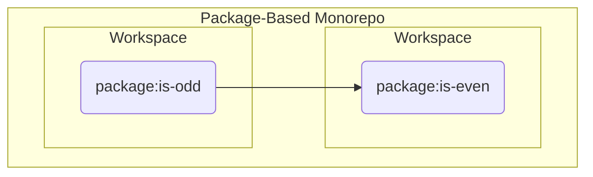

# [VCS] Understanding Nx & Monorepos I

*Dec 26 2022*

*Author: [Wonkook Lee](https://github.com/wonkooklee/today-i-learned)*

<br />

<!--  -->

<br />

## An Introduction to Nx Workspaces

> 모노레포와 Nx에 대해 알아본다.

<br />

## Integrated Repos vs. Package-Based Repos

통합된 레포와 패키지 기반 레포, 그리고 리액트와 앵귤러 앱의 Standalone 레포 중 선택해야 한다. 여기서 Integrated Repos와 Package-Based Repos는 짚고 넘어가야 한다.

- Package-based repos focus on flexibility and ease of adoption
- Integrated repos focus on efficiency and ease of maintenance.

패키지 기반 레포는 유연성과 빠른 적응에 특화되어 있고, 통합 레포는 효율성과 쉬운 유지 보수성에 초점을 두고 있다고 한다.

### Package-Based Repos

- 패키지 기반 레포는 `package.json` 파일과 중첩된 `node_modules`을 통해 서로 의존하는 패키지의 집합이다.
- Jest, Webpack과 같은 빌드 도구는 각 패키지 저장소에 있고, 마치 모든 종속성을 npm에 레지스트리에 퍼블리시된 패키지를 받아 사용하는 것처럼 작동한다.
- 따라서 기존 패키지를 별도로 빌드 설정을 건드리는 일 없이 패키지 기반 레포로 이관하기 쉽다.
- 하지만 레포 안에서 새로운 패키지를 생성하는 것은 처음부터 모든 빌드 툴을 만들어야 하기 때문에 새 저장소를 만드는 것 만큼이나 어렵다.
- Lerna, Yarn, Lage, Terborepo, Nx가 이 방식을 지원한다.

### Integrated Repos

- 통합 리파지토리는 표준 import 문을 통해 서로 의존하는 프로젝트를 포함한다.
- 일반적으로 루트에 정의도니 모든 종속성의 단일 버전이 있다.
- Jest와 Webpack과 같은 빌드 툴이 잘 작동하도록 래핑(Wrapping)해야 한다.
- 기존 패키지를 이 방식으로 병합시키는것은 빌드 설정을 변경시키는 것이 불가피하기 때문에 패키지 기반 레포 방식보다 어렵다.
- 하지만 빌드 세팅과 함께 이미 형성된 레포에서 새로운 프로젝트를 시작하는 것은 비교적 쉽다.
- Bazel과 플러그인을 사용한 Nx가 이 방식을 지원한다.

### How to Choose

- 비교적 적은 초기 비용으로 빠르게 모노레포를 사용하고 싶다면 package-based repos를 추천함
- 프로젝트의 확장성을 고려한다면 integrated repos를 추천함.
- 새 프로젝트를 만드는게 간단하면 모든 새로운 기능이 자체 프로젝트가 될 수 있고, 어플리케이션 간 코드를 공유하는것이 간단해지면서 유지 관리가 쉬워진다.
- 두 모노레포 방식의 차이는 JSDoc과 TypeScript의 차이와 유사하다.
- 전자는 채택하기 쉽고 바로 적용할 수 있다는 장점을 가져오지만, TypeScript는 더 큰 규모로의 확장을 고려했을때 더 나은 선택지가 될 수 있다.

<br />
<br />

# Hands on

## 1) Package-Based Monorepo

### 워크 스페이스 시작하는 방법

```bash
$ npx create-nx-workspace
$ # 버전, 프로젝트명, 모노레포 패키지 매니저 등, 옵션을 미리 지정할 수 있다.
$ npx create-nx-workspace@버전 프로젝트명 --preset=npm
```

모노레포 타입을 옵션으로 전달하지 않으면 나타나는 기본적인 대화형 인터페이스.

```bash
? Choose what to create                 …
Package-based monorepo: Nx makes it fast, but lets you run things your way.
Integrated monorepo:    Nx configures your favorite frameworks and lets you focus on shipping features.
Standalone React app:   Nx configures Vite, Vitest, ESLint, and Cypress.
Standalone Angular app: Nx configures Jest, ESLint and Cypress.
```

- 패키지 기반 모노레포: 기존 프로젝트를 빠르게 모노레포로 적용할 수 있는 장점
- 통합 모노레포: 추후 확장성을 고려했을때 좋은 선택
- 독립 실행형 리액트 앱
- 독립 실행형 앵귤러 앱

<br />
<br />
<br />

## 기본 구조

## 

```bash
# package-based monorepo
.
├── node_modules
│   └── packages
│       ├── package-1
│       │   └── package.json
│       ├── package-2
│       │   └── package.json
.       .
.       .
.       .
│       └── .gitkeep
├── .gitignore
├── nx.json
├── package-lock.json
├── package.json
└── README.md
```


```json
{
  "name": "package-based",
  "version": "0.0.0",
  "license": "MIT",
  "scripts": {},
  "private": true,
  "dependencies": {},
  "devDependencies": {
    "@nrwl/nx-cloud": "latest",
    "nx": "15.4.1",
    "prettier": "^2.6.2"
  },
  "workspaces": [
    "packages/*"
  ]
}
```

```json
{
  "extends": "nx/presets/npm.json",
  "$schema": "./node_modules/nx/schemas/nx-schema.json",
  "tasksRunnerOptions": {
    "default": {
      "runner": "@nrwl/nx-cloud",
      "options": {
        "cacheableOperations": [
          "build",
          "lint",
          "test",
          "e2e"
        ],
        "accessToken": "ZjM1YWY1MGYtYjNkOC00MjU5LTg0NGYtYWQwYzFiNWRiMjdlfHJlYWQtd3JpdGU="
      }
    }
  }
}
```
<br />
<br />

## 루트 레벨 의존성 설치

```bash
$ npm i dependency -w
$ npm i typescript -D -w
$ # -w [--workspace] 옵션을 사용할때 인자가 없으면 이는 워크스페이스 루트 레벨을 뜻한다.
```

<br />
<br />

## 하위 레벨 패키지 npm script 실행
```bash
$ nx run child-workspace:command
$ nx run is-even:build
```

<br />
<br />

## 각 워크스페이스의 패키지 의존성 참조



`is-odd` 패키지가 Dependency로써 `is-even` 패키지를 참조할 수 있도록 연결시키는 방법은 아래와 같다.

> 

#### 1) `package.json`에 의존성 명시
```json
"name": "is-odd",
/* ... */
"dependencies": {
  "is-even": "*" // latest version
}
```

<br />
<br />
<br />

## 2) Integrated Monorepo

```bash
npx create-nx-workspace@latest integrated --preset=ts
```

### 신규 워크스페이스 생성하기

CLI 버전
```bash
npx nx g [generate] @nrwl/js:library
```

GUI 버전


- VSCode 기준, `NX Console` Extension을 사용하면 훨씬 쉽게 라이브러리(패키지 또는 워크스페이스)를 만들 수 있다.
- 라이브러리 관련 설정, 번들러, 컴파일러, 린터, 테스트 러너 등 필요한 설정들이 보기 쉽게 나열되어있음

설정 메모
name, unitTestRunner 등 이름만 보면 짐작가는 것들을 제외하고 메모할만한 설정들.
- importPath: NPM 레지스트리에 퍼블리싱할때 사용될 라이브러리 명칭 (e.g. `@` 심볼로 나타내는 Package ownership 또는 Scoped packages 임을 표시할 수 있음 - @myorg/my-library)

<br />

```bash
# 설정을 마친 후 copy/paste 버튼을 눌러 세팅된 commands를 얻을 수 있음
nx generate @nrwl/js:library is-even --unitTestRunner=none --importPath=@wonkook/is-even --publishable
```

Local Linking


<br /><br /><br /><br />

---
## References
- [An Introduction to Nx Workspaces - Understanding Nx & Monorepos #1](https://www.youtube.com/watch?v=QqM3MlyurUA)
- [nx.dev | Integrated Repos vs. Package-Based Repos](https://nx.dev/concepts/integrated-vs-package-based)